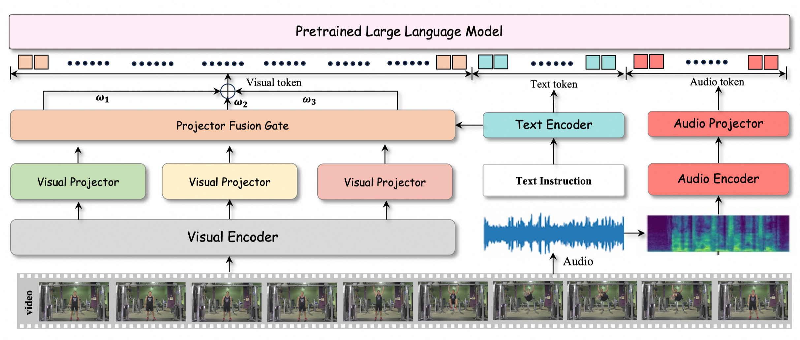

# HumanOmni: Human-Centric Omnimodal Large Language Model

  

## Introduction
**HumanOmni** is the industry's first human-centric omnimultimodal large language model designed to achieve comprehensive understanding in human-centric scenes.
1) **Domain-specific capability**: Trained on 2.4M human-centric video clips with 14M instructions
2) **Adaptive fusion**: Features three specialized branches with instruction-guided dynamic fusion
3) **Audio-visual synergy**: Integrates environmental audio cues with visual understanding
   
## Model Downloads

| **Model** | **#Total Params** | **Download-Huggingface** | **Download-ModelScope** |
| :------------: | :------------: | :------------: | :------------: |
| HumanOmni-Instruct | 7B |   |  |
| HumanOmni-Base | 7B |   | 

### Upcoming Releases
+ 2B-Lite 
+ 72B-Expert 

## Performance
Here are some performance benchmarks of HumanOmni across various tasks:

## Performance

Here are some performance benchmarks of HumanOmni across various tasks:

| Method                          | Modalities | DFEW (UAR) | DFEW (WAR) | MAFW (UAR) | MAFW (WAR) |
|----------------------------------|------------|-------------|-------------|-------------|-------------|
| **Specialized models for emotion-related tasks** |            |             |             |             |             |
| Wav2Vec2.0                   | A          | 36.15       | 43.05       | 21.59       | 29.69       |
| HuBERT                       | A          | 35.98       | 43.24       | 25.00       | 32.60       |
| DFER-CLIP                     | V          | 59.61       | 71.25       | 38.89       | 52.55       |
| MAE-DFER                      | V          | 63.41       | 74.43       | 41.62       | 54.31       |
| HiCMAE                        | AV         | 63.76       | 75.01       | 42.65       | 56.17       |
| Emotion-LLaMA                 | AV         | 64.21       | 77.06       | -           | -           |
| MMA-DFER                         | AV         | 66.85       | 77.43       | 44.25       | 58.45       |
| **Other models**                 |            |             |             |             |             |
| Qwen2-VL-7B                  | V          | 43.08       | 52.83       | 31.67       | 45.89       |
| Qwen2-VL-72B                  | V          | 39.24       | 45.12       | 42.61       | 46.07       |
| VITA                          | AV         | 21.36       | 32.07       | 14.05       | 33.38       |
| InternLM-XComposer-2.5-OL     | AV         | 44.23       | 51.29       | 33.78       | 46.81       |
| GPT4-O                       | AV         | 50.57       | 57.19       | 38.29       | 48.82       |
| **HumanOmni**                    | AV         | **74.86**   | **82.46**   | **52.94**   | **68.40**   |

## Environment Setup

To set up the recommended environment for HumanOmni, follow these instructions:

### Recommended Environment
- **Python**: >=3.10
- **CUDA**: >=12.1
- **PyTorch**: >=2.2 (with CUDA support)
- **Transformers**: >=4.45
- **Accelerate**: >=0.30.1
